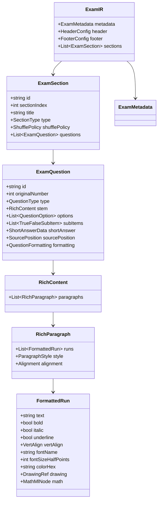

# 02. ĐẶC TẢ KIẾN TRÚC MÔ HÌNH TRUNG GIAN (EXAM INTERMEDIATE REPRESENTATION - IR)
**Dự án:** EXAM MIXER ENGINE  
**Tác giả:** Senior Software Architect + DOCX Processing Engineer  
**Phiên bản đặc tả:** 1.0.0-RC  

---

## 1. NGUYÊN TẮC THIẾT KẾ CỐT LÕI (DESIGN PRINCIPLES)

1. **Bảo toàn trung thực định dạng (Format Fidelity):** Tuyệt đối không lưu trữ nội dung dưới dạng Plain Text. Toàn bộ chuỗi văn bản trong câu hỏi, phương án, ý đúng sai phải là danh sách các `FormattedRun` giữ nguyên thuộc tính hiển thị (subscript, superscript, bold, italic, font, size, color, v.v.).
2. **Độc lập nền tảng (Platform & Tech-Stack Agnostic):** Exam IR được chuẩn hóa theo định dạng JSON Schema, tương thích hoàn toàn với C#, TypeScript/Node.js, Python hoặc Go.
3. **Phân ly giữa Dữ liệu học thuật và Đánh dấu kỹ thuật:** Tách biệt rõ ràng giữa thuộc tính "Nội dung học thuật" (Academic Content) và thuộc tính "Đáp án đúng" (Correct Answer). Đáp án đúng không phụ thuộc vào vị trí hiển thị mà gắn liền với ID định danh gốc.
4. **Hỗ trợ đầy đủ 3 loại câu hỏi chuẩn Bộ GD&ĐT Việt Nam:**
   - `MULTIPLE_CHOICE`: Trắc nghiệm 4 phương án chọn 1.
   - `TRUE_FALSE`: Trắc nghiệm Đúng / Sai theo nhóm 4 ý (a, b, c, d).
   - `SHORT_ANSWER`: Trắc nghiệm trả lời ngắn (điền số / chuỗi ngắn).

---

## 2. KIẾN TRÚC TỔNG THỂ CỦA EXAM IR



---

## 3. ĐẶC TẢ CHI TIẾT TỪNG THÀNH PHẦN DỮ LIỆU (TYPESCRIPT INTERFACES)

### 3.1. Cấp độ Run và Đoạn văn (Rich Content Model)

```typescript
/**
 * Vị trí trục đứng của Run: bình thường, chỉ số dưới, chỉ số trên.
 * Cực kỳ quan trọng để bảo toàn công thức hóa học: H2SO4, CnH2nO2.
 */
export type VertAlign = "baseline" | "subscript" | "superscript";

/**
 * Một Run định dạng cơ sở - đơn vị nhỏ nhất của văn bản có cùng kiểu trình bày.
 */
export interface FormattedRun {
  /** Văn bản thuần của run */
  text: string;
  
  /** In đậm */
  bold?: boolean;
  
  /** In nghiêng */
  italic?: boolean;
  
  /** Gạch chân (lưu ý: gạch chân đáp án gốc sẽ được bóc tách sang correctAnswer và xóa khỏi run) */
  underline?: "single" | "double" | "none";
  
  /** Gạch ngang chữ (nếu có) */
  strike?: boolean;
  
  /** Chỉ số trên/dưới: 'subscript' cho hóa học (H₂O), 'superscript' cho số mũ (x²) */
  vertAlign?: VertAlign;
  
  /** Tên font (mặc định: 'Times New Roman') */
  fontName?: string;
  
  /** Cỡ chữ tính theo half-points (24 = 12pt, 26 = 13pt) */
  fontSizeHalfPoints?: number;
  
  /** Mã màu Hex (ví dụ: '000000', '0000FF') */
  colorHex?: string;
  
  /** Màu highlight nền (nếu có) */
  highlightColor?: string;
  
  /** Tham chiếu hình ảnh nhúng trong run (nếu có) */
  drawingRef?: DrawingReference;
  
  /** Cấu trúc công thức toán/hóa học MathML/OMML (nếu có) */
  mathXml?: string;
}

/**
 * Thông tin tham chiếu hình ảnh
 */
export interface DrawingReference {
  imageId: string;          // Id duy nhất trong gói media
  fileName: string;         // image1.png
  contentType: string;      // image/png, image/jpeg
  widthDxa: number;         // Chiều rộng (dxa)
  heightDxa: number;        // Chiều cao (dxa)
  rawBytesBase64?: string;  // Dữ liệu nhị phân nếu lưu độc lập
}

/**
 * Đoạn văn bản giàu định dạng (Paragraph)
 */
export interface RichParagraph {
  runs: FormattedRun[];
  alignment?: "left" | "center" | "right" | "justify";
  spacingBeforeDxa?: number; // Ví dụ: 60 dxa
  spacingAfterDxa?: number;
  lineSpacingDxa?: number;
  isListItem?: boolean;
  tabStops?: TabStopDefinition[];
}

export interface TabStopDefinition {
  positionDxa: number; // 283, 2906, 5528, 8150
  alignment: "left" | "center" | "right";
}

/**
 * Nội dung đa đoạn văn
 */
export interface RichContent {
  paragraphs: RichParagraph[];
}
```

---

### 3.2. Cấu trúc Câu hỏi và Phân loại (Question Models)

```typescript
export type QuestionType = "MULTIPLE_CHOICE" | "TRUE_FALSE" | "SHORT_ANSWER";

/**
 * Phương án trắc nghiệm (Áp dụng cho MULTIPLE_CHOICE)
 */
export interface QuestionOption {
  id: string;                 // 'opt_1', 'opt_2',...
  originalLabel: "A" | "B" | "C" | "D"; // Nhãn ban đầu trong đề gốc
  currentLabel?: "A" | "B" | "C" | "D"; // Nhãn sau khi trộn
  content: RichContent;       // Nội dung phương án (giữ subscript, superscript,...)
  isCorrect: boolean;         // Trạng thái đúng được bóc tách từ gạch chân đề gốc
  isPinned?: boolean;         // Có bị cố định không được xáo trộn không (ví dụ "Cả 3 ý trên")
}

/**
 * Ý con trong câu hỏi Đúng / Sai (Áp dụng cho TRUE_FALSE)
 */
export interface TrueFalseSubItem {
  id: string;                 // 'sub_a', 'sub_b',...
  originalLabel: "a" | "b" | "c" | "d"; // Nhãn ban đầu
  currentLabel?: "a" | "b" | "c" | "d"; // Nhãn sau trộn (nếu bật cờ trộn ý)
  content: RichContent;       // Nội dung ý con
  isCorrect: boolean;         // true = Ý này ĐÚNG; false = Ý này SAI
  isPinned?: boolean;         // Có cố định vị trí không
}

/**
 * Dữ liệu trả lời ngắn (Áp dụng cho SHORT_ANSWER)
 */
export interface ShortAnswerData {
  expectedValue: string;      // Ví dụ: "200", "0.92", "3"
  acceptableAnswers?: string[]; // Các biến thể chấp nhận được: ["0,92", "0.92"]
  unit?: string;              // Đơn vị (nếu bóc tách được)
}

/**
 * Cấu trúc đối tượng Câu hỏi chuẩn
 */
export interface ExamQuestion {
  id: string;                 // Mã định danh duy nhất (UUID v4)
  sourcePosition: {
    sectionIndex: number;
    questionIndex: number;
    originalNumberStr: string;// "Câu 1."
    startParagraphIndex: number;
    endParagraphIndex: number;
  };
  type: QuestionType;
  stem: RichContent;          // Thân câu hỏi (bao gồm ngữ cảnh, công thức,...)
  
  // Dữ liệu riêng biệt theo từng Type:
  options?: QuestionOption[];       // MULTIPLE_CHOICE: luôn có 4 options
  subItems?: TrueFalseSubItem[];     // TRUE_FALSE: luôn có 4 subItems
  shortAnswer?: ShortAnswerData;     // SHORT_ANSWER: chứa giá trị đáp án mẫu
  
  // Thuộc tính điều khiển xáo trộn:
  allowShuffle: boolean;             // Cho phép xáo trộn câu này không
  allowOptionShuffle: boolean;       // Cho phép xáo trộn phương án bên trong không
  
  // Metadata định dạng đặc biệt
  formattingMetadata: {
    optionLayoutHint?: "auto" | "4_columns" | "2_columns" | "1_column";
    hasChemicalFormulas: boolean;
    hasMathExpressions: boolean;
    imageCount: number;
  };
}
```

---

### 3.3. Cấu trúc Phần (Section) và Bài thi (Exam Root)

```typescript
export interface ShufflePolicy {
  shuffleQuestions: boolean;       // Có xáo trộn thứ tự các câu hỏi không
  shuffleOptions: boolean;         // Có xáo trộn các phương án A, B, C, D không
  shuffleTrueFalseSubItems: boolean;// Có xáo trộn ý con a, b, c, d không (mặc định: false)
}

export interface ExamSection {
  id: string;                      // "sec_part_1", "sec_part_2",...
  sectionIndex: number;            // 1, 2, 3
  groupTag?: string;               // "<g0#1>", "<g0#2>", "<g0#3>"
  title: string;                   // "PHẦN I. Câu trắc nghiệm nhiều phương án lựa chọn."
  type: QuestionType;
  shufflePolicy: ShufflePolicy;
  questions: ExamQuestion[];
}

export interface HeaderConfig {
  schoolName?: string;             // Ví dụ: "TRƯỜNG THPT CHUYÊN..."
  examTitle: string;               // "KIỂM TRA CHƯƠNG ESTER - LIPID"
  subject?: string;                // "HÓA HỌC 12"
  durationMinutes?: number;        // 45
  studentInfoFields: {
    showStudentName: boolean;      // "Họ và tên: ............................."
    showStudentId: boolean;        // "Số báo danh: ......."
    showExamCode: boolean;         // "Mã đề 101"
  };
  tableBorderBottomSize: number;   // 12 (1.5 pt)
}

export interface FooterConfig {
  showExamCode: boolean;           // "Mã đề 101"
  showPageNumbers: boolean;        // "Trang 1/2"
  pageNumberFormat: "PageXofY" | "PageX"; // "Trang {PAGE}/{NUMPAGES}"
  topBorder: boolean;              // Đường kẻ ngang trên footer
}

export interface ExamMetadata {
  originalFileName: string;        // "DeGocTron.docx"
  createdAt: string;               // ISO 8601
  author?: string;
  sourceDocxProperties: {
    pageWidthDxa: number;          // 11906
    pageHeightDxa: number;         // 16838
    marginTopDxa: number;          // 567
    marginBottomDxa: number;       // 567
    marginLeftDxa: number;         // 1134
    marginRightDxa: number;        // 567
    defaultFont: string;           // "Times New Roman"
    defaultFontSizePt: number;     // 12
  };
}

export interface ExamIR {
  schemaVersion: "1.0.0";
  metadata: ExamMetadata;
  header: HeaderConfig;
  footer: FooterConfig;
  sections: ExamSection[];
}
```

---

## 4. VÍ DỤ JSON THỰC TẾ TRÍCH XUẤT TỪ `DeGocTron.docx`

### 4.1. Câu hỏi MULTIPLE_CHOICE (Câu 1 với công thức hóa học & đáp án gạch chân C)
```json
{
  "id": "q-mc-001",
  "type": "MULTIPLE_CHOICE",
  "stem": {
    "paragraphs": [
      {
        "runs": [
          { "text": "Câu 1. ", "bold": true },
          { "text": "Hợp chất nào sau đây thuộc loại ester?" }
        ]
      }
    ]
  },
  "options": [
    {
      "id": "opt-1-A",
      "originalLabel": "A",
      "content": {
        "paragraphs": [{
          "runs": [
            { "text": "CH" },
            { "text": "3", "vertAlign": "subscript" },
            { "text": "COOH" }
          ]
        }]
      },
      "isCorrect": false
    },
    {
      "id": "opt-1-B",
      "originalLabel": "B",
      "content": {
        "paragraphs": [{
          "runs": [
            { "text": "CH" },
            { "text": "3", "vertAlign": "subscript" },
            { "text": "CHO" }
          ]
        }]
      },
      "isCorrect": false
    },
    {
      "id": "opt-1-C",
      "originalLabel": "C",
      "content": {
        "paragraphs": [{
          "runs": [
            { "text": "CH" },
            { "text": "3", "vertAlign": "subscript" },
            { "text": "COOC" },
            { "text": "2", "vertAlign": "subscript" },
            { "text": "H" },
            { "text": "5", "vertAlign": "subscript" }
          ]
        }]
      },
      "isCorrect": true
    },
    {
      "id": "opt-1-D",
      "originalLabel": "D",
      "content": {
        "paragraphs": [{
          "runs": [
            { "text": "CH" },
            { "text": "3", "vertAlign": "subscript" },
            { "text": "CH" },
            { "text": "2", "vertAlign": "subscript" },
            { "text": "OH" }
          ]
        }]
      },
      "isCorrect": false
    }
  ],
  "formattingMetadata": {
    "optionLayoutHint": "4_columns",
    "hasChemicalFormulas": true,
    "hasMathExpressions": false,
    "imageCount": 0
  }
}
```

### 4.2. Câu hỏi TRUE_FALSE (Phần II - Câu 1)
```json
{
  "id": "q-tf-001",
  "type": "TRUE_FALSE",
  "stem": {
    "paragraphs": [{
      "runs": [
        { "text": "Câu 1. ", "bold": true },
        { "text": "Trong phòng thí nghiệm, một nhóm học sinh thực hiện phản ứng ester hóa giữa Acetic acid nguyên chất và Ethanol với xúc tác Sulfuric acid đặc..." }
      ]
    }]
  },
  "subItems": [
    {
      "id": "sub-1-a",
      "originalLabel": "a",
      "content": {
        "paragraphs": [{
          "runs": [{ "text": "Sulfuric acid đặc đóng vai trò vừa là chất xúc tác vừa là chất hút nước để chuyển dịch cân bằng." }]
        }]
      },
      "isCorrect": true
    },
    {
      "id": "sub-1-b",
      "originalLabel": "b",
      "content": {
        "paragraphs": [{
          "runs": [{ "text": "Sản phẩm hữu cơ thu được sau phản ứng có tên gọi là Methyl acetate." }]
        }]
      },
      "isCorrect": false
    },
    {
      "id": "sub-1-c",
      "originalLabel": "c",
      "content": {
        "paragraphs": [{
          "runs": [{ "text": "Việc sử dụng dung dịch Sodium chloride bão hòa giúp ester tách ra khỏi hỗn hợp tốt hơn." }]
        }]
      },
      "isCorrect": true
    },
    {
      "id": "sub-1-d",
      "originalLabel": "d",
      "content": {
        "paragraphs": [{
          "runs": [{ "text": "Nếu thay Ethanol bằng Methanol, sản phẩm thu được vẫn là Ethyl acetate." }]
        }]
      },
      "isCorrect": false
    }
  ]
}
```

### 4.3. Câu hỏi SHORT_ANSWER (Phần III - Câu 1)
```json
{
  "id": "q-sa-001",
  "type": "SHORT_ANSWER",
  "stem": {
    "paragraphs": [{
      "runs": [
        { "text": "Câu 1. ", "bold": true },
        { "text": "Để xà phòng hóa hoàn toàn 17,6 gam Ethyl acetate (CH" },
        { "text": "3", "vertAlign": "subscript" },
        { "text": "COOC" },
        { "text": "2", "vertAlign": "subscript" },
        { "text": "H" },
        { "text": "5", "vertAlign": "subscript" },
        { "text": ") cần dùng vừa đủ V ml dung dịch NaOH 1M. Tính giá trị của V." }
      ]
    }]
  },
  "shortAnswer": {
    "expectedValue": "200",
    "acceptableAnswers": ["200", "200.0"]
  }
}
```

---

## 5. TÍNH TOÀN VẸN VÀ BẤT BIẾN (IMMUTABILITY RULES)
1. **Khóa dữ liệu gốc (Raw Snapshot):** Mỗi đối tượng `ExamQuestion` chứa đầy đủ metadata về vị trí đoạn văn ban đầu (`sourcePosition`) phục vụ truy vết ngược (audit trail).
2. **Khử trùng định dạng đáp án (Answer Markup Sanitization):** Trong `stem`, `options.content`, và `subItems.content`, thuộc tính `underline` dùng để đánh dấu đáp án đúng trong đề gốc PHẢI BỊ LOẠI BỎ khỏi `FormattedRun` khi nạp vào IR để tránh rò rỉ đáp án khi xuất đề học sinh.
3. **Bảo tồn định dạng nội tại:** Các `FormattedRun` có `underline` phục vụ nhấn mạnh ngữ nghĩa của câu (ví dụ: *"chất nào sau đây <u>không</u> phải"*) PHẢI ĐƯỢC GIỮ LẠI nếu nó nằm trong thân câu hỏi (`stem`).
