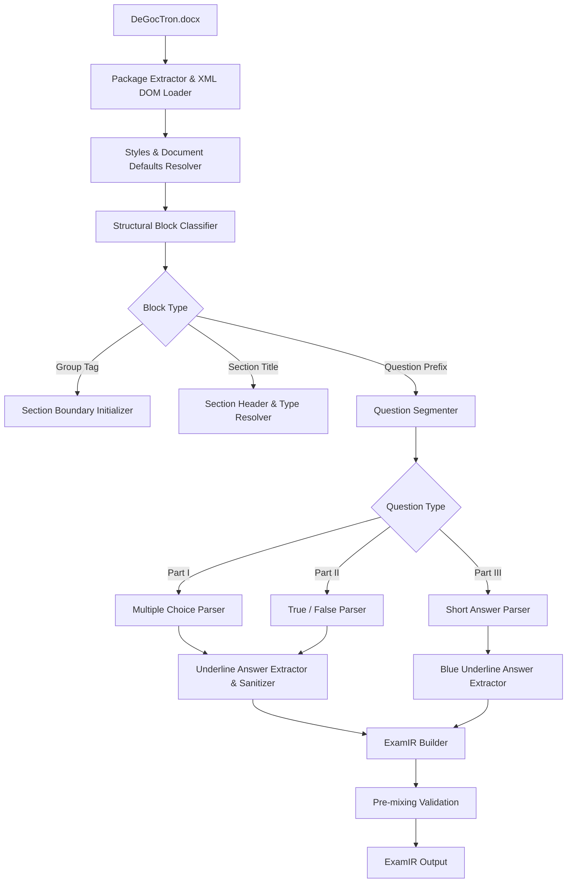

# 03. ĐẶC TẢ BỘ PHÂN TÍCH VĂN BẢN (DOCX PARSER SPECIFICATION)
**Dự án:** EXAM MIXER ENGINE  
**Thành phần:** `DocxExamParser`  
**Đầu vào:** `DeGocTron.docx` (OpenXML Package)  
**Đầu ra:** `ExamIR` (Mô hình trung gian chuẩn hóa)  
**Tác giả:** Senior Software Architect + DOCX Processing Engineer  

---

## 1. QUY TRÌNH XỬ LÝ TỔNG THỂ (PARSER PIPELINE)



---

## 2. BƯỚC 1: TRÍCH XUẤT GÓI & PHÂN GIẢI PHẠM VI (PACKAGE INITIALIZATION)

1. **Mở gói DOCX:**
   - Sử dụng thư viện truy xuất ZIP chuẩn (.NET `System.IO.Compression`, Python `zipfile`, Node `jszip`).
   - Đọc và phân giải:
     - `word/document.xml`: Chứa toàn bộ cây cấu trúc văn bản.
     - `word/styles.xml`: Chứa định nghĩa kiểu `Normal`, các font mặc định, cỡ chữ.
     - `word/_rels/document.xml.rels`: Chứa ánh xạ ID tài nguyên (hình ảnh, hyperlinks).
     - `word/numbering.xml`: Chứa danh sách đánh số tự động (nếu có).
2. **Khởi tạo Namespace Manager:**
   Toàn bộ truy vấn XPath phải được đăng ký không gian tên chuẩn:
   - `w`: `http://schemas.openxmlformats.org/wordprocessingml/2006/main`
   - `r`: `http://schemas.openxmlformats.org/officeDocument/2006/relationships`
   - `m`: `http://schemas.openxmlformats.org/officeDocument/2006/math`
   - `a`: `http://schemas.openxmlformats.org/drawingml/2006/main`

---

## 3. BƯỚC 2: NHẬN DIỆN RANH GIỚI VÀ PHÂN ĐOẠN (BOUNDARY CLASSIFICATION)

Duyệt tuần tự toàn bộ các nút con của `w:body` (`w:p`, `w:tbl`). Mỗi đoạn văn bản (`w:p`) được phân loại theo biểu thức chính quy (Regex) và phân tích Run:

### 3.1. Thẻ Nhóm Kỹ thuật (Group Tags)
- **Quy tắc nhận dạng:** Đoạn văn bản chỉ chứa mã dạng:
  `^<g(?<level>\d+)#(?<group>\d+)>$`
- **Ý nghĩa trong file mẫu `DeGocTron.docx`:**
  - `<g0#1>`: Bắt đầu Phần I (Group 0, Thứ tự 1).
  - `<g0#2>`: Bắt đầu Phần II (Group 0, Thứ tự 2).
  - `<g0#3>`: Bắt đầu Phần III (Group 0, Thứ tự 3).
- **Hành động của Parser:**
  - Thiết lập trạng thái `currentSectionIndex = int(group)`.
  - Không đưa đoạn văn bản này vào nội dung hiển thị của `ExamIR`.

### 3.2. Tiêu đề Phần (Section Titles)
- **Quy tắc nhận dạng:**
  - `PHẦN I` hoặc `PHẦN 1`: Chuyển sang chế độ `SectionType = MULTIPLE_CHOICE`.
  - `PHẦN II` hoặc `PHẦN 2`: Chuyển sang chế độ `SectionType = TRUE_FALSE`.
  - `PHẦN III` hoặc `PHẦN 3`: Chuyển sang chế độ `SectionType = SHORT_ANSWER`.
- **Hành động của Parser:**
  - Khởi tạo đối tượng `ExamSection`.
  - Lưu trữ tiêu đề gốc (ví dụ: *"PHẦN I. Câu trắc nghiệm nhiều phương án lựa chọn."*).

### 3.3. Điểm bắt đầu Câu hỏi (Question Start Sentinel)
- **Quy tắc nhận dạng:**
  Đoạn văn có Text bắt đầu bằng tiền tố:
  `^Câu\s+(?<qNum>\d+)[\.:]\s*(?<content>.*)`
  Và run đầu tiên thường có thuộc tính in đậm:
  `<w:rPr><w:b/></w:rPr>`
- **Hành động của Parser:**
  - Đóng câu hỏi trước đó (nếu đang xử lý dở).
  - Tạo mới một `ExamQuestion` với `originalNumber = int(qNum)`.

---

## 4. BƯỚC 3: CHI TIẾT BÓC TÁCH TỪNG LOẠI CÂU HỎI

### 4.1. Phân tích Câu hỏi Trắc nghiệm nhiều phương án (MULTIPLE_CHOICE)

#### Thuật toán bóc tách thân câu hỏi (Stem):
1. Thân câu hỏi bắt đầu từ nhãn `Câu X. ` (loại bỏ nhãn `Câu X. ` để tránh trùng lặp khi re-index).
2. Thu thập toàn bộ các đoạn văn tiếp theo cho đến khi gặp phương án `A.` đầu tiên. (Hỗ trợ câu hỏi có thân dài nhiều đoạn hoặc kèm hình ảnh).

#### Thuật toán bóc tách phương án và Đáp án đúng:
1. Mỗi phương án bắt đầu bằng chữ cái in hoa + dấu chấm/ngoặc:
   `^(?<optLabel>[A-D])[\.:\)]\s*(?<optText>.*)`
2. Với mỗi phương án, Parser kiểm tra toàn bộ các `w:r` bên trong paragraph:
   ```csharp
   bool isCorrect = false;
   foreach (var run in paragraph.SelectNodes(".//w:r", ns)) {
       var uNode = run.SelectSingleNode("./w:rPr/w:u", ns);
       if (uNode != null && uNode.Attributes["w:val"]?.Value == "single") {
           isCorrect = true;
           break;
       }
   }
   ```
3. **Quy tắc Khử trùng định dạng đáp án (Sanitization Rule):**
   - Đánh dấu `option.isCorrect = true`.
   - Khi chuyển đổi các Run của phương án sang `FormattedRun`, **GỠ BỎ** thuộc tính `underline = "single"` và `italic = true` (nếu italic chỉ dùng để nhấn mạnh đáp án đúng cùng với gạch chân) nhằm đảm bảo khi xuất đề cho học sinh, đáp án không bị lộ.
   - **Bảo lưu tuyệt đối:** Chỉ số dưới `<w:vertAlign w:val="subscript"/>` (ví dụ: $CH_3$, $C_2H_5$) và chỉ số trên `superscript`!

---

### 4.2. Phân tích Câu hỏi Đúng / Sai (TRUE_FALSE)

1. **Thân câu hỏi:** Đoạn dẫn ngữ cảnh bắt đầu bằng `Câu X.` (ví dụ: mô tả thí nghiệm ester hóa).
2. **Các ý con (Sub-items):**
   - Nhận dạng theo tiền tố chữ cái thường:
     `^(?<subLabel>[a-d])[\)\.:]\s*(?<subText>.*)`
   - Cần thu thập đủ 4 ý: `a)`, `b)`, `c)`, `d)`.
3. **Xác định trạng thái Đúng / Sai (Truth Value Extraction):**
   - Thuật toán kiểm tra thuộc tính gạch chân `w:u`:
     ```csharp
     bool isTrue = false;
     // Quét các run trong đoạn ý con
     foreach (var run in subItemParagraph.SelectNodes(".//w:r", ns)) {
         var uNode = run.SelectSingleNode("./w:rPr/w:u", ns);
         if (uNode != null && uNode.Attributes["w:val"]?.Value == "single") {
             isTrue = true;
             break;
         }
     }
     subItem.isCorrect = isTrue; // true = Đúng, false = Sai
     ```
   - **Khử trùng định dạng:** Xóa thuộc tính gạch chân khỏi các Run của ý con trước khi ghi vào `ExamIR`. Nhãn `a)`, `b)`, `c)`, `d)` được giữ in đậm theo chuẩn.

---

### 4.3. Phân tích Câu hỏi Trả lời ngắn (SHORT_ANSWER)

1. **Thân câu hỏi:** Đoạn bài toán tính toán bắt đầu bằng `Câu X.` (ví dụ: tính thể tích $V$, khối lượng $m$).
2. **Bóc tách Đáp án mẫu (Answer Key Paragraph):**
   - Ngay dưới đoạn câu hỏi là một đoạn chứa đáp án bắt đầu bằng:
     `^A\.\s*(?<answerVal>.*)`
   - Đoạn này có đặc điểm kỹ thuật phân biệt:
     - Run có gạch chân `<w:u w:val="single"/>`.
     - Run có màu xanh dương `<w:color w:val="0000FF"/>`.
   - **Xử lý trích xuất:**
     ```csharp
     string expectedValue = answerVal.Trim();
     question.shortAnswer = new ShortAnswerData {
         expectedValue = expectedValue,
         acceptableAnswers = GenerateVariants(expectedValue) // e.g. "0.92" -> ["0.92", "0,92"]
     };
     ```
   - **LOẠI BỎ HOÀN TOÀN paragraph đáp án này khỏi nội dung đề thi học sinh.**

---

## 5. BẢO TOÀN RUN-LEVEL VÀ ĐỊNH DẠNG HÓA HỌC (RUN EXTRACTOR ALGORITHM)

Mỗi khi chuyển đổi một phần tử OpenXML `<w:r>` sang `FormattedRun`, áp dụng thuật toán ánh xạ thuộc tính như sau:

```csharp
public FormattedRun ExtractRun(XmlElement rElem, XmlNamespaceManager ns, bool sanitizeAnswerUnderline) {
    var run = new FormattedRun();
    
    // 1. Trích xuất Text (hỗ trợ bảo toàn khoảng trắng xml:space="preserve")
    var tElem = rElem.SelectSingleNode("./w:t", ns) as XmlElement;
    run.Text = tElem != null ? tElem.InnerText : "";
    
    var rPr = rElem.SelectSingleNode("./w:rPr", ns);
    if (rPr != null) {
        // 2. In đậm
        run.Bold = rPr.SelectSingleNode("./w:b", ns) != null;
        
        // 3. In nghiêng
        run.Italic = rPr.SelectSingleNode("./w:i", ns) != null;
        
        // 4. Chỉ số trên / dưới (Hóa học CH3, H2SO4, CnH2nO2)
        var vertAlign = rPr.SelectSingleNode("./w:vertAlign", ns) as XmlElement;
        if (vertAlign != null) {
            string val = vertAlign.GetAttribute("w:val");
            if (val == "subscript") run.VertAlign = VertAlign.Subscript;
            else if (val == "superscript") run.VertAlign = VertAlign.Superscript;
        }
        
        // 5. Gạch chân (Underline)
        if (!sanitizeAnswerUnderline) {
            var uElem = rPr.SelectSingleNode("./w:u", ns) as XmlElement;
            if (uElem != null) {
                run.Underline = uElem.GetAttribute("w:val") ?? "single";
            }
        }
        
        // 6. Màu chữ (Color)
        var colorElem = rPr.SelectSingleNode("./w:color", ns) as XmlElement;
        if (colorElem != null) {
            run.ColorHex = colorElem.GetAttribute("w:val");
        }
        
        // 7. Font và Cỡ chữ
        var fontsElem = rPr.SelectSingleNode("./w:rFonts", ns) as XmlElement;
        if (fontsElem != null) {
            run.FontName = fontsElem.GetAttribute("w:ascii") ?? fontsElem.GetAttribute("w:hAnsi");
        }
        var szElem = rPr.SelectSingleNode("./w:sz", ns) as XmlElement;
        if (szElem != null && int.TryParse(szElem.GetAttribute("w:val"), out int sz)) {
            run.FontSizeHalfPoints = sz;
        }
    }
    
    return run;
}
```

---

## 6. XỬ LÝ LỖI VÀ TÌNH HUỐNG NGOẠI LỆ (ERROR & EDGE CASE HANDLING)

| Tình huống ngoại lệ | Cơ chế xử lý của Parser |
| :--- | :--- |
| **Thiếu phương án gạch chân trong Phần I** | Cảnh báo `WARNING_MISSING_CORRECT_ANSWER`: Đánh dấu câu hỏi cần người dùng chỉ định đáp án thủ công. Không làm gián đoạn parse toàn bộ đề. |
| **Gạch chân nhiều hơn 1 phương án trong Phần I** | Ghi nhận lỗi `ERROR_MULTIPLE_CORRECT_ANSWERS_IN_SINGLE_CHOICE` và chặn xuất file nếu không có cờ cho phép đề đa đáp án. |
| **Không tìm thấy thẻ `<g...>`** | Tự động phân tách phần dựa trên biểu thức nhận dạng tiêu đề `PHẦN I`, `PHẦN II`, `PHẦN III`. |
| **Phương án chứa ký tự xuống dòng mềm (`<w:br/>`)** | Chuyển đổi `<w:br/>` thành ký tự `\n` trong `FormattedRun` hoặc tách thành đoạn con tương ứng. |
| **Công thức hóa học bị tách thành nhiều Run nhỏ** | Bộ ghép Run thông minh (Run Merger) sẽ hợp nhất các run kế tiếp có cùng định dạng (cùng không có subscript hoặc cùng có subscript) để tối ưu hiệu năng. |
| **Ký tự đặc biệt (mũi tên phản ứng $\rightarrow$, $\rightleftharpoons$)** | Bảo toàn mã Unicode UTF-8 nguyên gốc. Không tự ý chuẩn hóa làm biến dạng ký hiệu chuyên ngành. |
