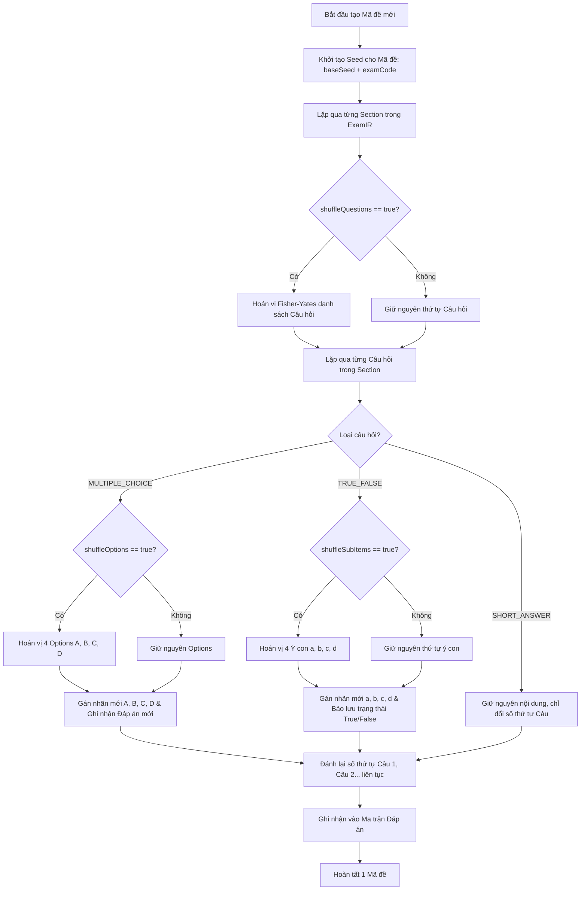

# 04. ĐẶC TẢ ĐỘNG CƠ TRỘN ĐỀ THI (MIXING ENGINE SPECIFICATION)
**Dự án:** EXAM MIXER ENGINE  
**Thành phần:** `ExamMixingEngine`  
**Đầu vào:** `ExamIR` (Mô hình gốc), `MixingConfiguration` (Seed, Danh sách mã đề, Tùy chọn)  
**Đầu ra:** Danh sách các `ExamIR` sau trộn (tương ứng từng Mã đề) + `ScoringMatrix` (Ma trận đáp án đối soát)  
**Tác giả:** Senior Software Architect + DOCX Processing Engineer  

---

## 1. NGUYÊN TẮC VẬN HÀNH CỦA ĐỘNG CƠ TRỘN (ENGINE PRINCIPLES)

1. **Tính tất định tuyệt đối (Deterministic Reproducibility):** Cùng một cấu hình `ExamIR` và cùng một giá trị `Seed` (ví dụ: `20260924`) BẮT BUỘC phải sinh ra chính xác 100% hoán vị câu hỏi, hoán vị phương án và mã đề giống hệt nhau ở mọi môi trường máy chủ/máy trạm.
2. **Bảo toàn tính toàn vẹn học thuật:** Nội dung thân câu hỏi và nội dung phương án/ý con tuyệt đối không bị thay đổi một ký tự hay một thuộc tính định dạng nào (subscript, superscript, in đậm, hình ảnh...).
3. **Cập nhật ánh xạ đáp án đúng theo thời gian thực:** Mỗi khi một phương án hoặc một câu hỏi bị đổi chỗ, con trỏ đáp án đúng phải tự động cập nhật sang nhãn hiển thị mới.
4. **Phân cấp độc lập theo Phần (Section Isolation):** Các câu hỏi thuộc Phần I không bao giờ bị trộn lẫn sang Phần II hay Phần III. Quá trình trộn diễn ra khép kín trong từng Section/Group.

---

## 2. THUẬT TOÁN SINH SỐ NGẪU NHIÊN GIẢ TẤT ĐỊNH (DETERMINISTIC PRNG)

Để đảm bảo kết quả như nhau trên mọi nền tảng (không phụ thuộc vào hàm `Math.random()` hay `rand()` vốn không cho phép truyền seed trên một số ngôn ngữ), Engine áp dụng thuật toán **Mulberry32** hoặc **PCG32**.

### 2.1. Cài đặt thuật toán Mulberry32:
```typescript
export class DeterministicRandom {
  private state: number;

  constructor(seed: number) {
    this.state = seed >>> 0;
  }

  /**
   * Sinh số thực ngẫu nhiên trong khoảng [0, 1)
   */
  public next(): number {
    let t = (this.state += 0x6d2b79f5);
    t = Math.imul(t ^ (t >>> 15), t | 1);
    t ^= t + Math.imul(t ^ (t >>> 7), t | 61);
    return ((t ^ (t >>> 14)) >>> 0) / 4294967296;
  }

  /**
   * Sinh số nguyên ngẫu nhiên trong khoảng [min, max]
   */
  public nextInt(min: number, max: number): number {
    return Math.floor(this.next() * (max - min + 1)) + min;
  }
}
```

---

## 3. THUẬT TOÁN HOÁN VỊ FISHER-YATES KHÔNG THIÊN VỊ (UNBIASED SHUFFLE)

Thuật toán xáo trộn mảng chuẩn Fisher-Yates (Knuth Shuffle) kết hợp với bộ sinh số `DeterministicRandom`:

```typescript
export function shuffleArray<T>(array: T[], rng: DeterministicRandom): T[] {
  const result = [...array];
  for (let i = result.length - 1; i > 0; i--) {
    const j = rng.nextInt(0, i);
    const temp = result[i];
    result[i] = result[j];
    result[j] = temp;
  }
  return result;
}
```

---

## 4. CHI TIẾT QUY TRÌNH TRỘN THEO TỪNG CẤP ĐỘ



### 4.1. Trộn Câu hỏi Trắc nghiệm nhiều phương án (MULTIPLE_CHOICE)

Giả sử Câu 1 trong Đề gốc có 4 phương án:
- `opt_A`: $CH_3COOH$ (`isCorrect = false`)
- `opt_B`: $CH_3CHO$ (`isCorrect = false`)
- `opt_C`: $CH_3COOC_2H_5$ (`isCorrect = true`) -> **ĐÁP ÁN ĐÚNG LÀ C**
- `opt_D`: $CH_3CH_2OH$ (`isCorrect = false`)

Khi thực hiện xáo trộn với `rng`:
1. Mảng 4 phương án được hoán vị ngẫu nhiên. Ví dụ thứ tự sau hoán vị:
   `[opt_C, opt_A, opt_D, opt_B]`.
2. Gán lại nhãn chữ cái hiển thị:
   - Vị trí 0: Gán nhãn `A. `, Nội dung: $CH_3COOC_2H_5$ (`isCorrect = true`)
   - Vị trí 1: Gán nhãn `B. `, Nội dung: $CH_3COOH$ (`isCorrect = false`)
   - Vị trí 2: Gán nhãn `C. `, Nội dung: $CH_3CH_2OH$ (`isCorrect = false`)
   - Vị trí 3: Gán nhãn `D. `, Nội dung: $CH_3CHO$ (`isCorrect = false`)
3. **Cập nhật Đáp án đúng của câu này:**
   - Trước khi trộn: Đáp án đúng là **C**.
   - Sau khi trộn: Đáp án đúng trở thành **A**!
4. Ghi nhận ánh xạ vào bảng đáp án:
   `AnswerKey[examCode][newQuestionIndex] = "A"`

### 4.2. Trộn Câu hỏi Đúng / Sai (TRUE_FALSE)

Đối với câu hỏi Đúng/Sai (ví dụ Câu 1 Phần II):
- Ban đầu:
  - `a)`: Đúng (`isCorrect = true`)
  - `b)`: Sai (`isCorrect = false`)
  - `c)`: Đúng (`isCorrect = true`)
  - `d)`: Sai (`isCorrect = false`)
- Cấu hình trộn:
  - Mặc định đề xuất: **Không xáo trộn các ý con** (`shuffleSubItems = false`) để đảm bảo logic tiến trình thí nghiệm của đề thi hóa học.
  - Nếu người dùng kích hoạt `shuffleSubItems = true`:
    1. Hoán vị 4 ý con: ví dụ `[c, a, d, b]`.
    2. Đánh lại nhãn:
       - `a)`: Nội dung ý `c` gốc (`isCorrect = true`)
       - `b)`: Nội dung ý `a` gốc (`isCorrect = true`)
       - `c)`: Nội dung ý `d` gốc (`isCorrect = false`)
       - `d)`: Nội dung ý `b` gốc (`isCorrect = false`)
    3. Ghi nhận vector đáp án đúng/sai mới: `[Đ, Đ, S, S]`.

### 4.3. Xử lý Câu hỏi Trả lời ngắn (SHORT_ANSWER)

- Các câu hỏi thuộc Phần III được xáo trộn thứ tự giữa các câu (Câu 1 $\leftrightarrow$ Câu 3 $\leftrightarrow$ Câu 5...).
- Giá trị đáp án mong đợi (`expectedValue = "200"`) gắn chặt với `question.id`, do đó khi câu hỏi di chuyển đến số thứ tự mới, đáp án đối soát tự động di chuyển theo:
  `AnswerKey[examCode][newQuestionIndex] = question.shortAnswer.expectedValue`

---

## 5. TỔ CHỨC ĐÁNH LẠI SỐ THỨ TỰ CÂU HỎI (RE-INDEXING POLICY)

1. **Đánh số độc lập theo từng Phần (Theo cấu trúc chuẩn Đề thi TN THPT từ 2025):**
   - **Phần I:** Đánh số từ `Câu 1.` đến `Câu 18.`
   - **Phần II:** Đánh số lại từ `Câu 1.` đến `Câu 4.`
   - **Phần III:** Đánh số lại từ `Câu 1.` đến `Câu 6.`
2. **Cập nhật Text của Run đầu tiên trong Stem:**
   - Run đầu tiên của câu hỏi gốc đang là: `<w:t>Câu 1. </w:t>`.
   - Engine tự động thay thế chuỗi này bằng `$"Câu {newIndex}. "` nhưng vẫn giữ nguyên cờ in đậm `<w:b/>` và định dạng font.

---

## 6. XUẤT MA TRẬN ĐÁP ÁN (ANSWER KEY MATRIX & SCORING SHEETS)

Sau khi trộn xong $N$ mã đề (ví dụ: 101, 102, 103, 104), Engine tự động kết xuất bảng đối soát đáp án toàn diện:

### Cấu trúc dữ liệu Bảng Đáp Án:
```json
{
  "examTitle": "KIỂM TRA CHƯƠNG ESTER - LIPID",
  "generatedDate": "2026-09-24T20:25:00Z",
  "seedUsed": 20260924,
  "examCodes": ["101", "102", "103", "104"],
  "keys": {
    "101": {
      "part_I": { "1": "C", "2": "B", "3": "B", "4": "A", "5": "C", "6": "B", "7": "A", "8": "A", "9": "B", "10": "B", "11": "C", "12": "C", "13": "B", "14": "B", "15": "C", "16": "B", "17": "D", "18": "B" },
      "part_II": {
        "1": { "a": "Đ", "b": "S", "c": "Đ", "d": "S" },
        "2": { "a": "Đ", "b": "Đ", "c": "Đ", "d": "Đ" },
        "3": { "a": "Đ", "b": "Đ", "c": "Đ", "d": "S" },
        "4": { "a": "Đ", "b": "Đ", "c": "S", "d": "Đ" }
      },
      "part_III": { "1": "200", "2": "0.92", "3": "3", "4": "5.28", "5": "88.4", "6": "1170" }
    },
    "102": {
      "part_I": { "1": "A", "2": "D", "3": "A", "...": "..." }
    }
  }
}
```

Ma trận này có thể được kết xuất ra file Excel (`.xlsx`), file Word bảng đáp án (`BangDapAn.docx`) hoặc file dữ liệu chấm trắc nghiệm điện tử (chấm điện thoại/máy quét).
