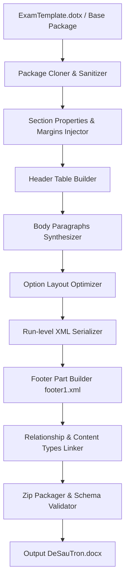

# 05. ĐẶC TẢ BỘ KẾT XUẤT TÀI LIỆU (DOCX RENDERER SPECIFICATION)
**Dự án:** EXAM MIXER ENGINE  
**Thành phần:** `DocxExamRenderer`  
**Đầu vào:** `ExamIR` đã được trộn cho từng Mã đề  
**Đầu ra:** `DeSauTron_{MaDe}.docx` (Tài liệu Word hoàn chỉnh, mở được trên MS Word, WPS Office, LibreOffice)  
**Tác giả:** Senior Software Architect + DOCX Processing Engineer  

---

## 1. CHIẾN LƯỢC KẾT XUẤT (RENDERING STRATEGY)

Engine áp dụng chiến lược **Template-Based OpenXML Synthesis (Tổng hợp OpenXML dựa trên phôi chuẩn)**.



### Ưu điểm vượt trội so với tạo file từ con số không:
1. **Kế thừa 100% tài nguyên:** Giữ nguyên các định nghĩa font `Times New Roman`, bảng mã ký tự tiếng Việt, theme màu sắc và styles chuẩn của Microsoft Office.
2. **Không lỗi Corrupted File:** Đảm bảo tính toàn vẹn của quan hệ gói OPC (`[Content_Types].xml`, `_rels/.rels`).
3. **Hiệu năng cực cao:** Không cần khởi chạy Microsoft Word Automation (không phụ thuộc COM Interop). Tốc độ sinh 1 đề chỉ dưới 50 mili-giây.

---

## 2. THIẾT KẾ CƠ CHẾ NÉN TRANG VÀ THUẬT TOÁN TÍNH TOÁN BỐ CỤC (LAYOUT OPTIMIZER)

### 2.1. Phân tích nguyên nhân giảm số trang từ 3 trang xuống 2 trang
Một trong những mục tiêu quan trọng nhất của giáo viên khi trộn đề là **tiết kiệm giấy in**: đề thi phải vừa khít trong đúng 1 tờ A4 (in 2 mặt = 2 trang).

File `DeGocTron.docx` ban đầu chiếm **3 trang** vì:
- 18 câu trắc nghiệm x 4 phương án = 72 dòng phương án riêng biệt.
- Mỗi câu trắc nghiệm chiếm ít nhất 5 dòng (1 dòng đề + 4 dòng phương án).
- Khoảng cách lề rộng lãng phí (1.27 cm ở cả 4 phía).
- Tồn tại 6 dòng đáp án của phần trả lời ngắn.

File `DeSauTron.docx` đã nén thành công về đúng **2 trang** nhờ 4 kỹ thuật tối ưu không gian:
1. **Thu hẹp lề trên/dưới/phải về 1.00 cm (567 dxa):** Tăng chiều cao khả dụng của trang giấy từ 24.3 cm lên **27.7 cm** (thêm được hơn 15 dòng văn bản trên mỗi trang!).
2. **Loại bỏ 6 dòng đáp án ngắn và 3 dòng thẻ nhóm:** Tiết kiệm 9 dòng.
3. **Dồn 10 câu trắc nghiệm ngắn thành 1 dòng (4 cột):** Tiết kiệm $10 \times 3 = 30$ dòng!
4. **Dồn 7 câu trắc nghiệm trung bình thành 2 dòng (2 cột):** Tiết kiệm $7 \times 2 = 14$ dòng!
$\rightarrow$ **Tổng cộng tiết kiệm được hơn 53 dòng văn bản**, đưa toàn bộ 28 câu hỏi nằm trọn vẹn trong đúng 2 trang A4!

---

### 2.2. Thuật toán tự động chọn Bố cục Phương án (Option Layout Selection Algorithm)

Bề rộng nội dung khả dụng: $W = 10,205$ dxa.

```typescript
export type OptionLayoutMode = "4_COLUMNS" | "2_COLUMNS" | "1_COLUMN";

export function determineOptionLayout(options: QuestionOption[]): OptionLayoutMode {
  // 1. Tính chiều dài chuỗi xấp xỉ của từng phương án
  const lengths = options.map(opt => {
    // Đếm tổng số ký tự thuần của phương án
    let charCount = 0;
    for (const p of opt.content.paragraphs) {
      for (const r of p.runs) {
        charCount += r.text.length;
      }
    }
    return charCount;
  });

  const maxLength = Math.max(...lengths);

  // 2. Ngưỡng phân loại dựa trên phân tích thực tế từ 18 câu đề mẫu:
  // - Nếu tất cả phương án <= 18 ký tự (hoặc công thức ngắn): 4 cột (1 dòng)
  // - Nếu tất cả phương án <= 45 ký tự: 2 cột (2 dòng)
  // - Nếu có phương án > 45 ký tự: 1 cột (4 dòng)
  if (maxLength <= 18) {
    return "4_COLUMNS";
  } else if (maxLength <= 45) {
    return "2_COLUMNS";
  } else {
    return "1_COLUMN";
  }
}
```

---

## 3. ĐẶC TẢ CẤU TRÚC XML KHI XUẤT CÁC PHƯƠNG ÁN TRẮC NGHIỆM

### 3.1. Chế độ 4 Cột (1 Dòng duy nhất)
Được áp dụng cho các câu 1, 2, 3, 4, 5, 6, 9, 11, 13, 18.
- **Khai báo Tab Stops:**
  ```xml
  <w:pPr>
    <w:tabs>
      <w:tab w:val="left" w:pos="283"/>
      <w:tab w:val="left" w:pos="2906"/>
      <w:tab w:val="left" w:pos="5528"/>
      <w:tab w:val="left" w:pos="8150"/>
    </w:tabs>
  </w:pPr>
  ```
- **Nội dung Paragraph:**
  ```xml
  <!-- Nhãn A. in đậm có tab -->
  <w:r><w:rPr><w:rStyle w:val="YoungMixChar"/><w:b/></w:rPr><w:tab/><w:t xml:space="preserve">A. </w:t></w:r>
  <!-- Các Run nội dung của A (chỉ số dưới, chỉ số trên được bảo lưu) -->
  <w:r><w:t>CH</w:t></w:r>
  <w:r><w:rPr><w:vertAlign w:val="subscript"/></w:rPr><w:t>3</w:t></w:r>
  <w:r><w:t>COOH</w:t></w:r>
  
  <!-- Nhãn B. in đậm có tab -->
  <w:r><w:rPr><w:rStyle w:val="YoungMixChar"/><w:b/></w:rPr><w:tab/><w:t xml:space="preserve">B. </w:t></w:r>
  <w:r><w:t>CH</w:t></w:r>
  <w:r><w:rPr><w:vertAlign w:val="subscript"/></w:rPr><w:t>3</w:t></w:r>
  <w:r><w:t>CHO</w:t></w:r>
  
  <!-- Nhãn C. in đậm có tab -->
  <w:r><w:rPr><w:rStyle w:val="YoungMixChar"/><w:b/></w:rPr><w:tab/><w:t xml:space="preserve">C. </w:t></w:r>
  <w:r><w:t>CH</w:t></w:r>
  <w:r><w:rPr><w:vertAlign w:val="subscript"/></w:rPr><w:t>3</w:t></w:r>
  <w:r><w:t>COOC</w:t></w:r>
  <w:r><w:rPr><w:vertAlign w:val="subscript"/></w:rPr><w:t>2</w:t></w:r>
  <w:r><w:t>H</w:t></w:r>
  <w:r><w:rPr><w:vertAlign w:val="subscript"/></w:rPr><w:t>5</w:t></w:r>
  
  <!-- Nhãn D. in đậm có tab -->
  <w:r><w:rPr><w:rStyle w:val="YoungMixChar"/><w:b/></w:rPr><w:tab/><w:t xml:space="preserve">D. </w:t></w:r>
  <w:r><w:t>CH</w:t></w:r>
  <w:r><w:rPr><w:vertAlign w:val="subscript"/></w:rPr><w:t>3</w:t></w:r>
  <w:r><w:t>CH</w:t></w:r>
  <w:r><w:rPr><w:vertAlign w:val="subscript"/></w:rPr><w:t>2</w:t></w:r>
  <w:r><w:t>OH</w:t></w:r>
  ```

---

### 3.2. Chế độ 2 Cột (2 Dòng)
Được áp dụng cho các câu 7, 8, 10, 14, 15, 16, 17.
- **Khai báo Tab Stops:** Cả 2 dòng đều có:
  ```xml
  <w:pPr>
    <w:tabs>
      <w:tab w:val="left" w:pos="283"/>
      <w:tab w:val="left" w:pos="5528"/>
    </w:tabs>
  </w:pPr>
  ```
- **Dòng 1:** `<w:tab/><w:t>A. </w:t><content A><w:tab/><w:t>B. </w:t><content B>`
- **Dòng 2:** `<w:tab/><w:t>C. </w:t><content C><w:tab/><w:t>D. </w:t><content D>`

---

### 3.3. Chế độ 1 Cột (4 Dòng)
Được áp dụng cho câu 12 (phương án dài).
- Mỗi phương án là 1 paragraph riêng biệt có `<w:tab w:val="left" w:pos="283"/>`.
- Cấu trúc: `<w:tab/><w:t>A. </w:t><content A>`

---

## 4. XUẤT CÂU HỎI ĐÚNG / SAI VÀ TRẢ LỜI NGẮN

### 4.1. Câu hỏi Đúng / Sai (Phần II)
- Đoạn thân câu hỏi được in đậm tiền tố `Câu X. `, nội dung ngữ cảnh giữ nguyên.
- 4 ý con $a, b, c, d$ mỗi ý chiếm 1 paragraph riêng có tab `pos="283"`:
  ```xml
  <w:p>
    <w:pPr>
      <w:tabs><w:tab w:val="left" w:pos="283"/></w:tabs>
    </w:pPr>
    <w:r><w:rPr><w:rStyle w:val="YoungMixChar"/><w:b/></w:rPr><w:tab/><w:t xml:space="preserve">a) </w:t></w:r>
    <!-- Toàn bộ gạch chân đáp án đúng ĐÃ ĐƯỢC XÓA HOÀN TOÀN -->
    <w:r><w:t>Sulfuric acid đặc đóng vai trò vừa là chất xúc tác...</w:t></w:r>
  </w:p>
  ```

### 4.2. Câu hỏi Trả lời ngắn (Phần III)
- Xuất thân câu hỏi: `Câu X. ` (In đậm) + Nội dung bài toán.
- **KHÔNG XUẤT BẤT KỲ DÒNG ĐÁP ÁN NÀO.** Học sinh sẽ tự điền câu trả lời vào phiếu trả lời trắc nghiệm.

---

## 5. THIẾT KẾ TIÊU ĐỀ VÀ BẢNG THÔNG TIN THÍ SINH

Ngay sau thẻ mở `<w:body>`:
1. **Tiêu đề Đề thi:**
   ```xml
   <w:p>
     <w:pPr><w:jc w:val="center"/><w:rPr><w:b/></w:rPr></w:pPr>
     <w:r><w:rPr><w:b/></w:rPr><w:t>KIỂM TRA CHƯƠNG ESTER - LIPID</w:t></w:r>
   </w:p>
   ```
2. **Bảng Họ tên, Số báo danh, Mã đề:**
   Bảng gồm 1 hàng 3 ô, không đường viền dọc, chỉ có viền đáy (`w:bottom w:val="single" w:sz="12"`):
   - Ô 1: Chiều rộng `6123` dxa, chứa `Họ và tên: ............................................................................`
   - Ô 2: Chiều rộng `2041` dxa, chứa `Số báo danh: .......`
   - Ô 3: Chiều rộng `2041` dxa, chứa `Mã đề {examCode}` (Căn giữa, In đậm).

---

## 6. THIẾT KẾ FOOTER ĐỘNG (DYNAMIC FOOTER ENGINE)

Renderer tạo file `word/footer1.xml` với nội dung chuẩn OpenXML:
```xml
<?xml version="1.0" encoding="UTF-8" standalone="yes"?>
<w:ftr xmlns:w="http://schemas.openxmlformats.org/wordprocessingml/2006/main">
  <w:p>
    <w:pPr>
      <!-- Đường kẻ mảnh phía trên footer -->
      <w:pBdr><w:top w:val="single" w:sz="6" w:space="1" w:color="auto"/></w:pBdr>
      <!-- Tab căn phải ở biên trang phải -->
      <w:tabs><w:tab w:val="right" w:pos="10489"/></w:tabs>
    </w:pPr>
    <!-- Bên trái: Mã đề -->
    <w:r><w:t>Mã đề {examCode}</w:t></w:r>
    <!-- Nhảy tab sang bên phải -->
    <w:r><w:tab/><w:t xml:space="preserve">Trang </w:t></w:r>
    <!-- Trường động: Số trang hiện tại -->
    <w:r><w:fldChar w:fldCharType="begin"/></w:r>
    <w:r><w:instrText>Page</w:instrText></w:r>
    <w:r><w:fldChar w:fldCharType="separate"/></w:r>
    <w:r><w:t>1</w:t></w:r>
    <w:r><w:fldChar w:fldCharType="end"/></w:r>
    <w:r><w:t>/</w:t></w:r>
    <!-- Trường động: Tổng số trang -->
    <w:r><w:fldChar w:fldCharType="begin"/></w:r>
    <w:r><w:instrText>NUMPAGES</w:instrText></w:r>
    <w:r><w:fldChar w:fldCharType="separate"/></w:r>
    <w:r><w:t>2</w:t></w:r>
    <w:r><w:fldChar w:fldCharType="end"/></w:r>
  </w:p>
</w:ftr>
```

Đồng thời trong `word/document.xml`, phần `w:sectPr` cuối tài liệu liên kết footer này bằng:
`<w:footerReference w:type="default" r:id="rId7"/>`
và khai báo quan hệ trong `word/_rels/document.xml.rels`:
`<Relationship Id="rId7" Type="http://schemas.openxmlformats.org/officeDocument/2006/relationships/footer" Target="footer1.xml"/>`

---

## 7. ĐOẠN KẾT THÚC ĐỀ THI (END SENTINEL)
Trước thẻ đóng `w:sectPr`, Renderer tự động chèn một đoạn ngắt kết thúc đề thi:
```xml
<w:p>
  <w:pPr><w:jc w:val="center"/><w:rPr><w:b/></w:rPr></w:pPr>
  <w:r><w:rPr><w:b/></w:rPr><w:t>------ HẾT ------</w:t></w:r>
</w:p>
```
Đoạn này giúp thí sinh biết chắc chắn đề thi đã kết thúc trọn vẹn, không bị mất trang hay in thiếu câu.
