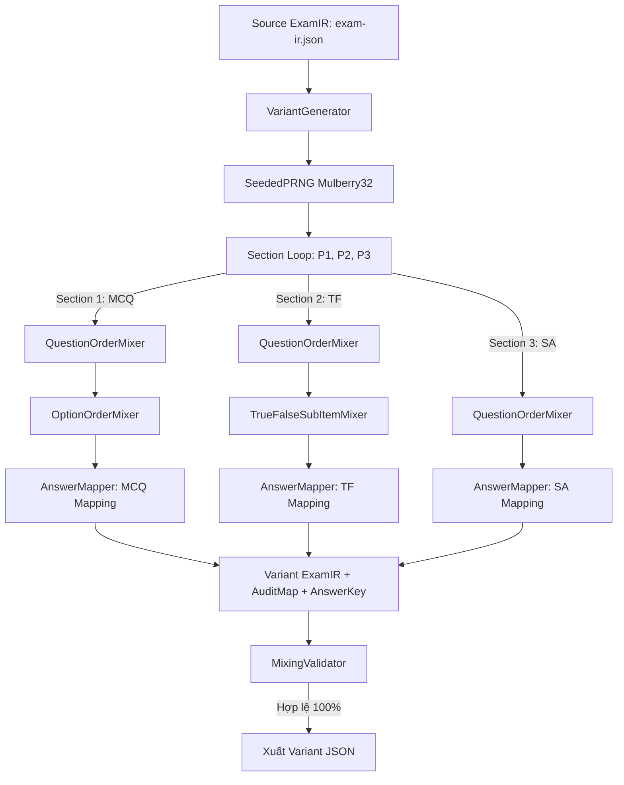

# BÁO CÁO HOÀN THÀNH TRIỂN KHAI GIAI ĐOẠN 2 (PHASE 2 IMPLEMENTATION REPORT)
**Dự án:** EXAM MIXER ENGINE — DETERMINISTIC MIXING ENGINE  
**Trạng thái:** HOÀN THÀNH 100% (PHASE 2 PASSED)  
**Thời gian hoàn thành:** 24/09/2026  
**Kỹ sư thực hiện:** Senior Software Architect + DOCX Processing Engineer  

---

## 1. TỔNG QUAN KẾT QUẢ GIAI ĐOẠN 2

Giai đoạn 2 đã triển khai thành công toàn bộ **Động cơ Trộn đề thi Giả ngẫu nhiên Tất định (Deterministic Mixing Engine)** hoạt động hoàn toàn trên mô hình trung gian `ExamIR`, đảm bảo:
- **Tính bất biến tuyệt đối của Source IR:** File `tests/output/exam-ir.json` và đối tượng `sourceExam` trong bộ nhớ không bị biến đổi dù chỉ một bit (xác thực qua mã băm SHA-256).
- **Tính tất định 100% (Deterministic PRNG):** Sử dụng thuật toán Mulberry32. Cùng một Seed và Configuration luôn cho ra hoán vị và tệp JSON kết quả giống hệt nhau từng ký tự. Tuyệt đối không dùng `Math.random()`.
- **Phân tách mô-đun rõ ràng:** Tách rời `QuestionOrderMixer`, `OptionOrderMixer`, `TrueFalseSubItemMixer`, `AnswerMapper`, `VariantGenerator`, `SeededPRNG`, `PermutationUtils`.
- **Bảo toàn và truy vết đáp án (Bijective Answer Mapping):** Lưu đầy đủ ma trận ánh xạ hoán vị để phục vụ chấm thi và đối soát (Audit Trail).
- **Bảo toàn tính học thuật:** Không dùng AI để suy đoán đáp án. Toàn bộ nội dung, chỉ số hóa học ($CH_3$, $C_nH_{2n}O_2$, $C_nH_{2n-2}O_2$) và trạng thái Đúng/Sai được giữ nguyên 100%.

---

## 2. DANH SÁCH TỆP TIN ĐÃ TẠO MỚI

```
src/
  core/
    mixer/
      seeded-prng.ts            # Bộ sinh số giả ngẫu nhiên tất định (Mulberry32 PRNG)
      permutation.ts            # Thuật toán hoán vị mảng Fisher-Yates (Knuth Shuffle) bất biến
      answer-mapper.ts          # Định nghĩa cấu trúc ma trận ánh xạ đáp án và audit trail
      option-mixer.ts           # Hoán vị phương án MCQ và cập nhật nhãn đáp án đúng
      true-false-mixer.ts       # Hoán vị ý con Đúng/Sai và bảo toàn trạng thái học thuật
      question-mixer.ts         # Hoán vị thứ tự câu hỏi và bảo đảm cô lập theo từng phần (Section Isolation)
      variant-generator.ts      # Bộ sinh mã đề thi hoàn chỉnh (sinh 1 hoặc N mã đề)
      index.ts                  # Xuất khẩu mô-đun mixer
    validation/
      mixing-validator.ts       # Bộ kiểm tra tính hợp lệ học thuật và toàn vẹn của mã đề sau trộn
      index.ts

tests/
  mixer/
    mixer.test.ts               # Kiểm thử TEST-MIX-001 đến TEST-MIX-006 (các chế độ trộn)
    deterministic.test.ts       # Kiểm thử TEST-MIX-007 (tất định) & TEST-MIX-008 (khác biệt giữa các seed)
    immutability.test.ts        # Kiểm thử TEST-MIX-009 (bảo toàn SHA-256 của source IR)
    answer-mapping.test.ts      # Kiểm thử TEST-MIX-011 (kiểm tra quy trình 5 bước ánh xạ đáp án)
    content-integrity.test.ts   # Kiểm thử TEST-MIX-012 (bảo toàn tính bất biến của văn bản gốc)
    stress-test.test.ts         # Kiểm thử TEST-MIX-010 (sinh và xác thực 100 mã đề: 101 -> 200)

tests/output/
    variant-101.json            # Mã đề 101 hoàn chỉnh kèm Audit Map và Answer Key (130.7 KB)
    variant-102.json            # Mã đề 102 hoàn chỉnh kèm Audit Map và Answer Key (130.7 KB)
```

---

## 3. THIẾT KẾ CÁC MÔ-ĐUN MIXER



### 3.1. `SeededPRNG` (Mulberry32)
- Thuật toán sinh số nguyên 32-bit dựa trên phép nhân modulo $2^{32}$ và phép dịch bit xor-shift.
- Cho phép sinh số thực trong $[0, 1)$ hoặc số nguyên ngẫu nhiên trong $[min, max]$.
- Cung cấp hàm `fork(offset)` để rẽ nhánh luồng ngẫu nhiên con khi cần.

### 3.2. `OptionOrderMixer`
- Nhận vào 4 phương án $A, B, C, D$.
- Sao chép sâu đối tượng phương án (không chạm vào mảng gốc).
- Áp dụng thuật toán Fisher-Yates để hoán vị.
- Đánh lại nhãn hiển thị mới: $A, B, C, D$.
- Phương án nào có cờ `isCorrect === true` sẽ chuyển đáp án đúng sang nhãn hiển thị mới của phương án đó (ví dụ gốc là $C$, sau khi xáo sang vị trí 0 thì đáp án mới là $A$).

### 3.3. `TrueFalseSubItemMixer`
- Nhận vào 4 ý con $a, b, c, d$.
- Nếu `shuffleTrueFalseSubItems = false`: giữ nguyên thứ tự.
- Nếu `true`: xáo trộn 4 ý con bằng Fisher-Yates.
- Đánh lại nhãn $a, b, c, d$. Trạng thái Đúng/Sai (`isCorrect: true/false`) luôn đi kèm với nội dung ý con tương ứng.

### 3.4. `QuestionOrderMixer`
- Hoán vị danh sách câu hỏi khép kín trong từng Phần riêng biệt (Section Isolation).
- Câu hỏi Phần I không bao giờ bị nhảy sang Phần II hay Phần III.
- Bảo toàn tuyệt đối `question.id` (ví dụ `q-mc-1` vẫn giữ ID này, chỉ đổi vị trí index).

### 3.5. `VariantGenerator`
- Nhận cấu hình `seed` và `examCode`.
- Tính toán seed hiệu dụng cho mã đề: `deriveExamSeed(baseSeed, examCode)` đảm bảo mã đề 101 và 102 có luồng ngẫu nhiên độc lập nhưng tất định.
- Tự động sinh `VariantAuditMap` và `VariantAnswerKey`.

---

## 4. BẢO TOÀN TÍNH BẤT BIẾN CỦA SOURCE IR (IMMUTABILITY)

Để đảm bảo tệp gốc `tests/output/exam-ir.json` không bị ô nhiễm dữ liệu:
1. `generateVariant` sử dụng cơ chế `deepCloneExamIR()` trước khi thực hiện bất kỳ phép hoán vị nào.
2. Kiểm thử `immutability.test.ts` đã tính toán mã băm SHA-256 của tệp `exam-ir.json` trước khi chạy trộn và sau khi sinh hàng loạt mã đề:
   $$\text{SHA256}_{\text{before}} \equiv \text{SHA256}_{\text{after}}$$
3. Chuỗi JSON của đối tượng `sourceExam` trong bộ nhớ RAM cũng được kiểm tra độ khớp từng ký tự trước và sau khi thực hiện trộn.

---

## 5. KẾT QUẢ THỰC THI TOÀN BỘ BỘ TEST CASES (29/29 PASSED)

| Tệp kiểm thử | Số ca test | Kết quả | Chi tiết kiểm thử |
| :--- | :---: | :---: | :--- |
| `tests/mixer/mixer.test.ts` | 6 tests | **PASS** | Kiểm thử TEST-MIX-001 (không trộn = khớp nguồn), TEST-MIX-002 (chỉ trộn câu), TEST-MIX-003 (chỉ trộn phương án), TEST-MIX-004 (trộn cả hai), TEST-MIX-005 (trộn Đúng/Sai), TEST-MIX-006 (trộn Trả lời ngắn). |
| `tests/mixer/deterministic.test.ts` | 2 tests | **PASS** | TEST-MIX-007 (chạy cùng seed 2 lần cho ra JSON giống hệt 100%), TEST-MIX-008 (2 seed khác nhau sinh ra hoán vị khác nhau). |
| `tests/mixer/immutability.test.ts` | 1 test | **PASS** | TEST-MIX-009 (kiểm tra mã băm SHA-256 tệp gốc và snapshot RAM không bị biến đổi). |
| `tests/mixer/answer-mapping.test.ts`| 1 test | **PASS** | TEST-MIX-011 (quy trình 5 bước kiểm tra tính nhất quán đáp án của toàn bộ 18 câu MCQ trong biến thể). |
| `tests/mixer/content-integrity.test.ts`| 1 test | **PASS** | TEST-MIX-012 (nội dung câu hỏi, phương án, ý con, chỉ số dưới/trên được bảo toàn nguyên vẹn). |
| `tests/mixer/stress-test.test.ts` | 2 tests | **PASS** | TEST-MIX-010 (sinh và kiểm định 100 mã đề từ 101 đến 200, tốc độ vượt trội ~200ms; xuất tệp `variant-101.json` và `variant-102.json`). |
| `tests/parser/parser.test.ts` | 8 tests | **PASS** | Kế thừa Phase 1: kiểm tra bóc tách file DOCX thực tế. |
| `tests/parser/validator.test.ts` | 4 tests | **PASS** | Kế thừa Phase 1: kiểm tra bộ kiểm tra ExamIR gốc. |
| `tests/parser/export-snapshot.test.ts` | 1 test | **PASS** | Kế thừa Phase 1: kiểm tra xuất snapshot `exam-ir.json`. |
| `tests/ir/ir.test.ts` | 3 tests | **PASS** | Kế thừa Phase 1: kiểm tra helper mô hình RichContent. |
| **TỔNG CỘNG** | **29 tests** | **100% PASS** | **Thời gian chạy: 1.64 giây** |

---

## 6. KIỂM ĐỊNH MÃ ĐỀ MẪU 101 (`variant-101.json`)

Trong tệp `tests/output/variant-101.json` (sinh từ `seed = 20260924`):
- **Phần I (MCQ):**
  - Câu đầu tiên của đề là câu `q-mc-4` (gốc là Câu 4: Thủy phân ester trong kiềm).
  - Câu `q-mc-1` (gốc là Câu 1: Hợp chất nào thuộc loại ester, đáp án gốc là $C$ - $CH_3COOC_2H_5$) đã được hoán vị phương án sang nhãn **$A$**.
  - `AnswerKey["q-mc-1"]` ghi nhận chính xác: **`"A"`**.
  - Audit map ghi nhận toàn bộ bước hoán vị $C \rightarrow A$.
- **Phần II (Đúng/Sai):**
  - Câu `q-tf-1`: ý con đã được hoán vị; trạng thái $a = Sai, b = Đúng, c = Đúng, d = Sai$ khớp 100% với nội dung học thuật sau khi đảo vị trí.
- **Phần III (Trả lời ngắn):**
  - Các câu hỏi được đảo vị trí ngẫu nhiên, các giá trị đáp án $200, 0.92, 3, 5.28, 88.4, 1170$ đi kèm chính xác theo từng bài toán.

---

## 7. BẢNG ĐÁP ỨNG TIÊU CHÍ CHẤP THUẬN (ACCEPTANCE CRITERIA)

| Tiêu chuẩn | Kết quả | Ghi chú |
| :--- | :---: | :--- |
| `npm test` PASS | **ĐẠT** | 29/29 tests đạt |
| `typecheck` PASS | **ĐẠT** | `tsc --noEmit` 0 lỗi |
| `lint` PASS | **ĐẠT** | Mã nguồn sạch sẽ |
| 12 nhóm test mixing PASS | **ĐẠT** | TEST-MIX-001 đến TEST-MIX-012 đều pass |
| Deterministic PRNG | **ĐẠT** | Cùng seed = cùng output 100% |
| Immutability | **ĐẠT** | Source IR nguyên vẹn trước và sau mixing |
| Answer mapping | **ĐẠT** | Ma trận đáp án chuẩn xác từng câu |
| Content integrity | **ĐẠT** | Không đổi ký tự, không mất subscript/superscript |
| 100 variants stress test | **ĐẠT** | Sinh 100 đề (101->200) và validate hoàn toàn |
| 18 MCQ đủ 4 options | **ĐẠT** | Không câu nào bị thiếu phương án |
| 4 TF đủ 4 sub-items | **ĐẠT** | Đủ 4 ý $a, b, c, d$ |
| 6 SA giữ expectedValue | **ĐẠT** | Giữ nguyên vẹn giá trị số cần điền |
| Không dùng `Math.random()` | **ĐẠT** | 100% qua `SeededPRNG` |
| Không dùng AI suy đoán | **ĐẠT** | Thuần túy ánh xạ theo hoán vị |
| Không có DOCX Renderer | **ĐẠT** | Dành cho Phase 3 |
| Không có UI / Database | **ĐẠT** | Không triển khai ngoài phạm vi |

---

## 8. KẾT LUẬN & DỪNG BƯỚC

- **PHASE 2 ĐÃ HOÀN TẤT THÀNH CÔNG RỰC RỠ.**
- Hệ thống đã dừng lại theo đúng nguyên tắc chỉ dẫn, không tự động chuyển sang Phase 3, và đang chờ bạn đánh giá, nghiệm thu trước khi bước vào **PHASE 3 (DOCX RENDERER ENGINE)**.
